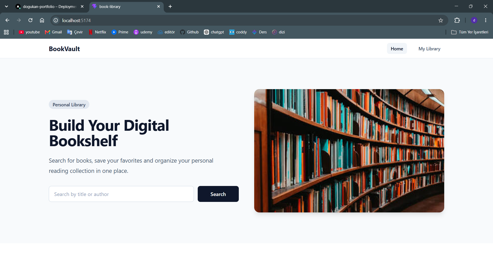
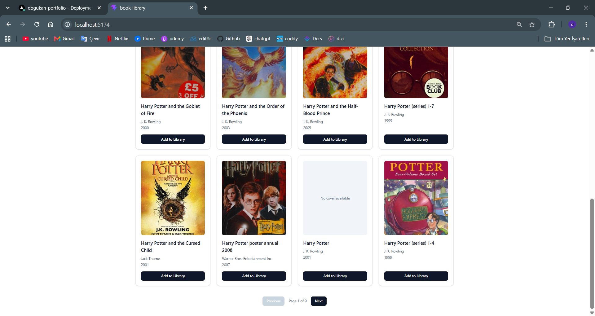
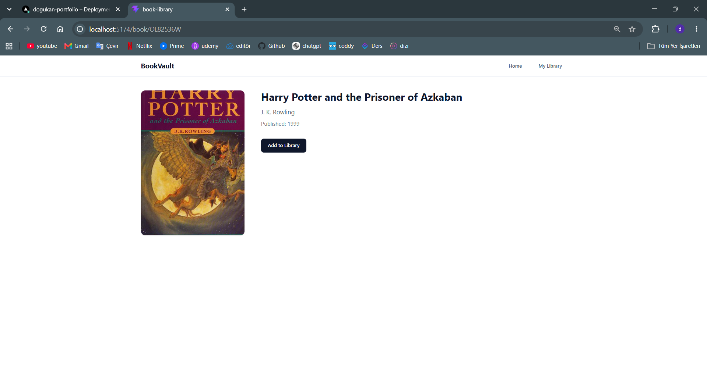
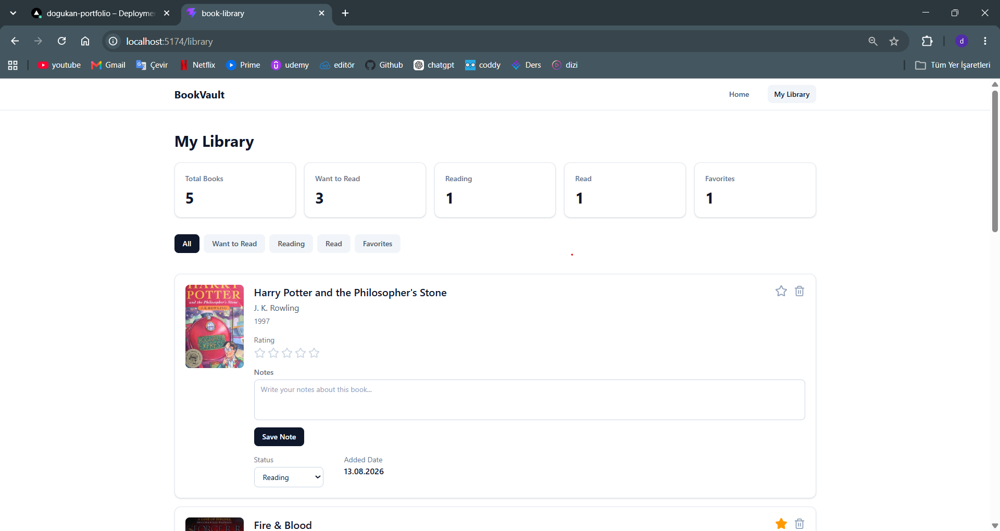

# 📚 BookVault

BookVault is a responsive personal library management application built with **React** and **Vite**.

Users can search for books through the **Open Library API**, explore book details, create and manage a personal reading library, track reading progress, rate books, save personal notes, manage favorites, and keep their collection persisted locally.

---

## 🌐 Live Demo

🔗 [**View BookVault Live**](https://book-library-xi-sable.vercel.app/)

---

## ✨ Features

### 🔎 Book Search

- Search for books by title or author
- Powered by the Open Library API
- Loading, error, and empty-result states
- Paginated search results
- Displays 12 books per page
- Pagination automatically resets after a new search

### 📖 Book Details

- Navigate directly from search results to a dedicated book detail page
- View:
  - Book cover
  - Title
  - Author
  - Publication year

- Load book information even if the book has not yet been added to the personal library
- Add books directly from the detail page

### 📚 Personal Library

Users can build and manage their own book collection with:

- Reading status:
  - Want to Read
  - Reading
  - Read

- 1–5 star rating
- Personal notes
- Favorite toggle
- Remove from library
- Duplicate prevention

### 📊 Library Statistics

The library dashboard provides automatically updated statistics for:

- Total Books
- Want to Read
- Reading
- Read
- Favorites

Statistics automatically update whenever the library changes.

### 🎯 Library Filters

Users can filter their library by:

- All
- Want to Read
- Reading
- Read
- Favorites

Dedicated empty states are displayed when a filter has no matching books.

### 💾 Persistent Storage

BookVault uses **localStorage** to persist the user's library.

Saved books and their associated:

- Reading status
- Rating
- Notes
- Favorite status

remain available after refreshing or reopening the application.

### 📱 Responsive Design

The interface is designed to work across:

- Mobile
- Tablet
- Desktop

Navigation, search results, library cards, statistics, forms, and book detail layouts adapt to different screen sizes.

### 🚨 Error & Empty States

The application includes dedicated UI states for:

- Empty searches
- No search results
- API errors
- Empty library
- Empty filtered library
- Missing book details
- Unknown routes with a custom 404 page

---

## 📸 Screenshots

### Home



### Search Results



### Book Detail



### My Library



---

## 🛠️ Tech Stack

- **React**
- **Vite**
- **JavaScript**
- **Tailwind CSS**
- **React Router**
- **Context API**
- **Custom React Hooks**
- **Axios**
- **Lucide React**
- **Open Library API**
- **localStorage**
- **ESLint**
- **Vercel**

---

## 🧠 Architecture

The project separates UI components, global application state, API communication, and reusable business logic into dedicated layers.

```text
src/
├── assets/
├── components/
│   ├── BookCard.jsx
│   ├── Hero.jsx
│   ├── LibraryBookCard.jsx
│   ├── LibraryStats.jsx
│   ├── Navbar.jsx
│   ├── NotesEditor.jsx
│   └── SearchResult.jsx
│
├── contexts/
│   ├── LibraryContext.jsx
│   └── LibraryContextProvider.jsx
│
├── hooks/
│   └── useBookDetail.js
│
├── pages/
│   ├── BookDetail.jsx
│   ├── Home.jsx
│   ├── MyLibrary.jsx
│   └── NotFound.jsx
│
├── services/
│   ├── api.js
│   └── openLibrary.js
│
├── App.jsx
├── main.jsx
└── index.css
```

### Global State Management

The application uses the **Context API** to manage the global library state.

The library provider is responsible for operations such as:

- Adding books
- Removing books
- Updating reading status
- Updating ratings
- Saving notes
- Toggling favorites
- Persisting the library to localStorage

Separating the context definition from the provider keeps the global state structure organized and easier to maintain.

### Custom Hook

The `useBookDetail` custom hook handles book detail resolution.

It first checks whether the requested book already exists in the user's personal library.

If the book is not stored locally, the hook retrieves its information from the Open Library API.

This keeps asynchronous data-fetching and book-resolution logic separate from the `BookDetail` UI component.

### API Layer

API communication is isolated inside the `services` directory.

Axios is used for HTTP requests, while Open Library-specific requests and response transformations are handled separately from the UI components.

This separation keeps components focused on presentation and interaction instead of API implementation details.

---

## 🚀 Getting Started

### 1. Clone the repository

```bash
git clone https://github.com/Dogukan3648/book-library.git
```

### 2. Navigate to the project

```bash
cd book-library
```

### 3. Install dependencies

```bash
npm install
```

### 4. Start the development server

```bash
npm run dev
```

The development server will start locally using Vite.

---

## 📦 Available Scripts

### Development

```bash
npm run dev
```

Starts the Vite development server.

### Production Build

```bash
npm run build
```

Creates an optimized production build.

### Lint

```bash
npm run lint
```

Runs ESLint to check the project for code-quality issues.

### Preview

```bash
npm run preview
```

Runs the production build locally for preview.

---

## ✅ Quality Checks

Before deployment, the project was verified with:

```bash
npm run lint
npm run build
```

The final application passes ESLint checks and successfully generates a production build.

Core user flows were also manually tested, including:

- Book search
- Search pagination
- Pagination reset after a new search
- Book detail navigation
- Loading book details from the API
- Adding books to the library
- Duplicate prevention
- Reading status updates
- Ratings
- Notes
- Favorites
- Library filters
- Library statistics
- Removing books
- localStorage persistence
- 404 routing
- Responsive layouts
- Production routing and page refresh behavior

---

## 🌐 Open Library API

BookVault uses the **Open Library API** as its external book data source.

The application uses Open Library for:

- Book search
- Work details
- Author information
- Book covers

---

## 🚀 Deployment

The application is deployed with **Vercel**.

Production URL:

[**https://book-library-xi-sable.vercel.app**](https://book-library-xi-sable.vercel.app)

The production version was tested for core application flows and client-side route refresh behavior after deployment.

---

## 🔮 Future Improvements

Possible future enhancements include:

- Library sorting
- Advanced search filters
- Search suggestions
- Custom confirmation modal
- More detailed book metadata
- Advanced reading statistics
- Dark mode
- User authentication
- Cloud-based library synchronization
- Backend database integration

---

## 👨‍💻 Author

**Doğukan Bozkır**

- GitHub: [Dogukan3648](https://github.com/Dogukan3648)
- LinkedIn: [Doğukan Bozkır](https://www.linkedin.com/in/dogukanbozkir/)

---

## 📌 Project Purpose

BookVault was developed as a portfolio project to practice and demonstrate modern React development concepts including:

- Component-based architecture
- Global state management with Context API
- Custom React hooks
- REST API integration
- Client-side routing
- Persistent client-side storage
- Responsive UI development
- State synchronization across pages and components
- Loading and error-state management
- Production deployment

The project focuses not only on implementing features, but also on maintaining a clear separation of responsibilities and building a maintainable React application.
